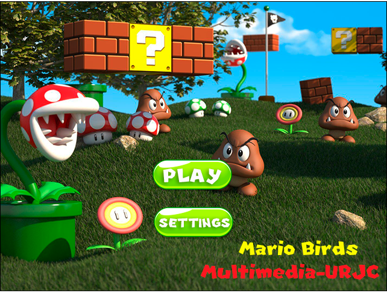

# Mario Birds

Juego realizado con HTML5 y JS basado en "Angry Birds" y con la temática del clásico "Super Mario Bros"

## Explicación del proyecto

Inicialmente obtuvimos el código de un juego en HTML5 que consistía en una imitación al clásico juego de móviles “Angry Birds”, pero con temática de Comida Saludable vs Comida Basura.
Este juego estaba programado en JavaScript, ayudado por las librerías de jQuery y Box2D, usando principalmente el canvas de HTML5 como elemento donde renderizar el juego. 

Nuestro objetivo en esta práctica ha sido implementar la aplicación Froot wars y cambiar assets, héroes, villanos, añadir más niveles y añadir más funcionalidades.

### Propuestas de modificacion

* **Modernización del código**: Para ajustarse a las nuevas capacidades ofrecidas por el lenguaje a raíz de sus revisiones (ES2015, ES2016 ...)
* **Adición de un menú de opciones**: Desde el cual poder controlar el volumen deseado dentro del juego pudiendo incluso silenciar el juego.
* **Modificación de temática**: Modificación de la temática del juego a una elegida por nosotros, en este caso “Mario Bross” modificando todos los assets y todos los aspectos del juego según sean necesarios.
* **Adición de niveles**: Añadir 12 niveles de dificultad


### Juego online

Simplemente deberás entrar en la pagina del proyecto:

https://victoriamg.github.io/Mario-Birds/

### Jugar con el proyecto en local

Para jugar a Mario Birds únicamente se debe descargar el proyecto alojado en Github y, a continuación, abrir el fichero index.

```
index.html
```

Con esto ya estaríamos ejecutando el juego en el navegador que elijamos al abrirlo.

Esta sería la primera pantalla que veriamos al iniciarlo:



## Demo

* [](https://www.youtube.com/watch?v=X4WkziUUUCY "Mario Birds")

## Entidades del juego

* 17 nuevos enemigos
* 5 nuevas estructuras
* 4 nuevos héroes

## Funcionalidades nuevas

* **Menú de opciones**:
Creamos un menú propio,en este nuevo menú, añadimos un slider para poder controlar el volumen. 

* **Puntuación**:
    * **Coin Mario**: se ha añadido un gif con la clásica moneda de Mario, además se ha añadido una funcionalidad extra al juego incluyendo un sonido en la moneda cada vez que se obtengan nuevos puntos a sumar.
    * **Fuente Score**: Se ha modificado la fuente del score a “New Super Mario Font U”.

## Herramientas utilizadas

* [WebStorm](https://www.jetbrains.com/webstorm/) - IDE principal de desarrollo
* [Sublimetext3](https://www.sublimetext.com/3) - Modificaciones puntuales en el código
* [Photoshop cs6](https://www.adobe.com/es/products/photoshop.html?gclid=CjwKCAjw1KLkBRBZEiwARzyE76-i84VNNjIC5lScDbEw1hL3jRXAx0Dfi9q6SdJK4J90NBw50rP2IBoCtLwQAvD_BwE&sdid=8DN85NTQ&mv=search&ef_id=CjwKCAjw1KLkBRBZEiwARzyE76-i84VNNjIC5lScDbEw1hL3jRXAx0Dfi9q6SdJK4J90NBw50rP2IBoCtLwQAvD_BwE:G:s&s_kwcid=AL!3085!3!276559263832!e!!g!!adobephotoshop) - Diseño de todas las imagenes


## Autores

* **Victoria MG** - *Desarrollo y diseño* - [VictoriaMG](https://github.com/VictoriaMG)
* **Hugo Vizcaino Santana** - *Desarrollo* - [HugoVizcainoSantana](https://github.com/HugoVizcainoSantana)

## Créditos

* Fuente utilizada: - [New super mario bros](https://www.dafont.com/es/forum/read/61824/new-super-mario-bros)
* Moneda Super Mario: - [Gif Coin](https://gifimage.net/wp-content/uploads/2017/10/mario-coin-animated-gif-10.gif)
* Imagenes Super Mario e información: [Wiki Super Mario](https://mario.fandom.com/es/wiki/Bowser)

## Inspiration

* Pro HTML5 Games: Learn to Build your Own Games using HTML5 and JavaScript - [Enlace al libro](https://www.amazon.es/Pro-HTML5-Games-Learn-JavaScript/dp/1484229096/ref=dp_ob_title_bk)

## License

This project is licensed under the Apache License 2.0 - see the [LICENSE.md](LICENSE.md) file for details

